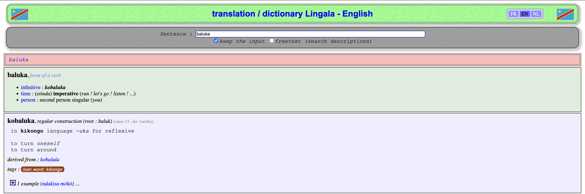

# balukajs

Baluka (pronounce _balooka_) is a tiny library that takes your json file and gives you back a jsdoc types or typescript interfaces definition.

Am I the only one who are tired to manually update my ts interfaces or jsdoc when my json data evolve ?

That's why I wanted to dedicate this task to an automated process.

## Installation

Just simply:

```bash
bun add balukajs
```

And that's it ! You ready to use baluka.

# Usage

The only command to use for running baluka is **blk**.

With that, we have 5 arguments as follows:

- Input (-i or --input): A mandatory argument whose value is the json file. Ex: ```-i input.json```.
Be aware that baluka checks if the file is json and will throw error otherwise :)

- Output (-o or --output): An optional argument whose value is the file which will contains jsdoc types or typescript interfaces. If not passed, baluka will print output in your console / terminal. Ex: ```-o output.js``` or ```--output types.ts```.

- Name (--name): An optional argument whose value is the name of the main type of your type definition. Ex: ```--name IExample```.

- Format (--format): An optional argument which is the format of the output type definition. Only 2 values: **jsdoc** and **ts**. Ex: ```--format ts```.
By default, if --format is not passed, jsdoc will be applied.

- Watch (--watch): An optional but absolutely necessary argument. With no value to pass, this argument triggers watch mode, and re-execute baluka when input file changed.

We also have --help / -h, which prints available arguments.

## Roadmap

The essential works have been done. By automated a type definition conversion from a json file to jsdoc or typescript, you can safely and peacefully updated your json as much as you want.

What coming soon is json schema as new format value. Don't hesitate to discuss with me if it's relevant.

## Use Cases

### Check examples to see some practical examples of baluka usage

- [Managing translation json files](examples/translation/index.md)

And you ? What will you achieve with baluka ? Let me know ;)

**Baluka is a lingala word meaning _to turn around_.**

