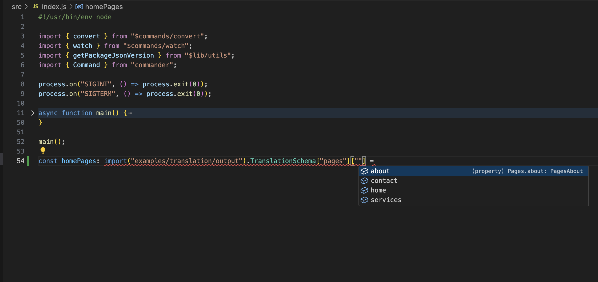

# Translation management or i18n

Let say you build a website which deal with translations. You use whatever librairie of your choice and, as further you go, you want your editor to help find the appropriate keys to translate. You firstly choose to define types to handle your json translate object. Then, manually update types becomes cumbersome and boring !

This is a json you'll probably have (find it in input.json):

```
{
    "pages": {
      "home": {
        "seo": {
          "title": "Welcome to Our Home Page",
          "description": "This is the home page of our website where you can find the latest updates and news."
        },
        "content": {
          "header": "Welcome to Our Website",
          "body": "Discover our latest offerings and stay updated with our news."
        }
      },
      "about": {
        "seo": {
          "title": "About Us",
          "description": "Learn more about our company, our mission, and our values."
        },
        "content": {
          "header": "Who We Are",
          "body": "We are a company committed to delivering the best services to our customers."
        }
      },
      "services": {
        "seo": {
          "title": "Our Services",
          "description": "Explore the wide range of services we offer to meet your needs."
        },
        "content": {
          "header": "What We Offer",
          "body": "From consulting to implementation, we provide comprehensive solutions."
        }
      },
      "contact": {
        "seo": {
          "title": "Contact Us",
          "description": "Get in touch with us for any inquiries or support."
        },
        "content": {
          "header": "Reach Out to Us",
          "body": "We are here to help you with any questions or concerns you may have."
        }
      }
    },
    "menu": {
      "main": [
        { "key": "home", "link": "/", "text": "Home" },
        { "key": "about", "link": "/about", "text": "About Us" },
        { "key": "services", "link": "/services", "text": "Services" },
        { "key": "contact", "link": "/contact", "text": "Contact" }
      ],
      "footer": [
        { "key": "privacy", "link": "/privacy", "text": "Privacy Policy" },
        { "key": "terms", "link": "/terms", "text": "Terms of Service" },
        { "key": "help", "link": "/help", "text": "Help Center" }
      ]
    }
}
```

### See how this is BIG !!!

To type this, a pretty good solution is [Transform Tools](https://transform.tools/json-to-typescript). It's a website that convert for you a large formats, including json, in other formats. Very useful when you start but becomes tedious in the long run.

Now with balukajs, you only have to do this:

```
blk -i my/json/file.json -o output.ts --format ts --name TranslationSchema --watch
```

And that's it !!!

Add new keys, remove another one, do whatever you want, baluka will update your type definition.

Final typescript types are:
```
export interface TranslationSchema {
  pages: Pages;
  menu: Menu;
}

export interface Menu {
  main: MenuMain[];
  footer: MenuFooter[];
}

export interface MenuFooter {
  key: string;
  link: string;
  text: string;
}

export interface MenuMain {
  key: string;
  link: string;
  text: string;
}

export interface Pages {
  home: PagesHome;
  about: PagesAbout;
  services: PagesServices;
  contact: PagesContact;
}

export interface PagesContact {
  seo: PagesContactSeo;
  content: PagesContactContent;
}

export interface PagesContactContent {
  header: string;
  body: string;
}

export interface PagesContactSeo {
  title: string;
  description: string;
}

export interface PagesServices {
  seo: PagesServicesSeo;
  content: PagesServicesContent;
}

export interface PagesServicesContent {
  header: string;
  body: string;
}

export interface PagesServicesSeo {
  title: string;
  description: string;
}

export interface PagesAbout {
  seo: PagesAboutSeo;
  content: PagesAboutContent;
}

export interface PagesAboutContent {
  header: string;
  body: string;
}

export interface PagesAboutSeo {
  title: string;
  description: string;
}

export interface PagesHome {
  seo: PagesHomeSeo;
  content: PagesHomeContent;
}

export interface PagesHomeContent {
  header: string;
  body: string;
}

export interface PagesHomeSeo {
  title: string;
  description: string;
}
```

Here is a screenshot of autocompletion
